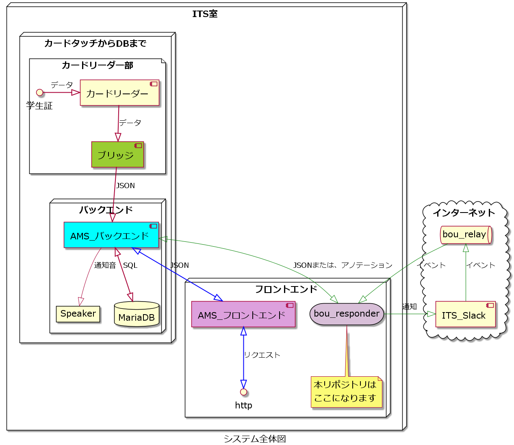

# bou-responder

## 必要なモノ

- 証明書 [ここから取得できます](https://beebotte.com/docs/mqtt)

---

本リポジトリはこのような立ち位置になっています。

---

## 関係のあるリポジトリ一覧

## 議論したり、作業の優先順位を付けるリポジトリ

[ams-project](https://github.com/su-its/ams-project)

---

## カードリーダー部

[カードリーダー部のブリッジ](https://github.com/su-its/rdr-bridge)

---

## バックエンド部

[AMS_バックエンド](https://github.com/su-its/ams-backend)

---

## フロントエンド部

[AMS_フロントエンド](https://github.com/su-its/ams-frontend)
